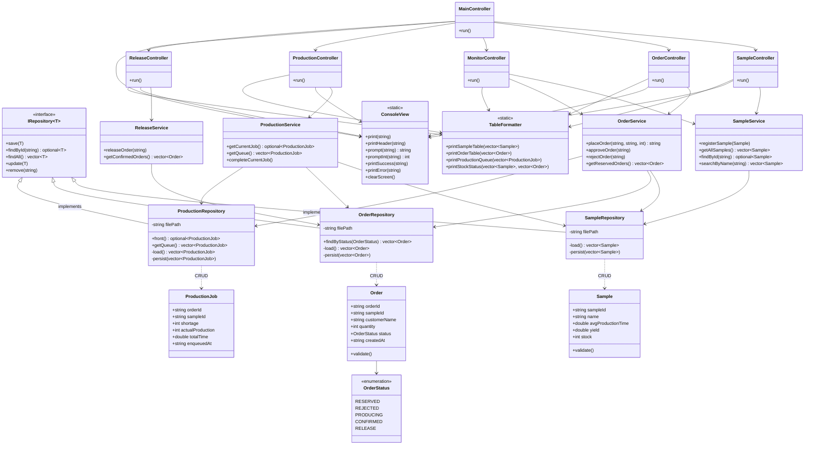

# 클래스 다이어그램 (설계 UML)



## 레이어 의존 방향 요약

```
View (ConsoleView, TableFormatter)
         ↑
Controller (Main / Sample / Order / Monitor / Production / Release)
         ↓
Service (SampleService / OrderService / ProductionService / ReleaseService)
         ↓
Repository (SampleRepository / OrderRepository / ProductionRepository)
         ↓
JSON 파일 (data/samples.json, orders.json, production_jobs.json)
```

> 모든 의존은 상위 → 하위 단방향. 하위 레이어는 상위를 알지 못합니다.
