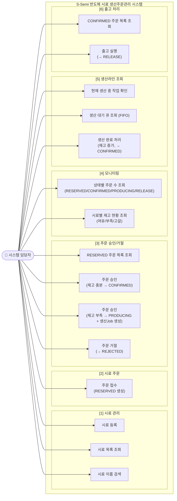
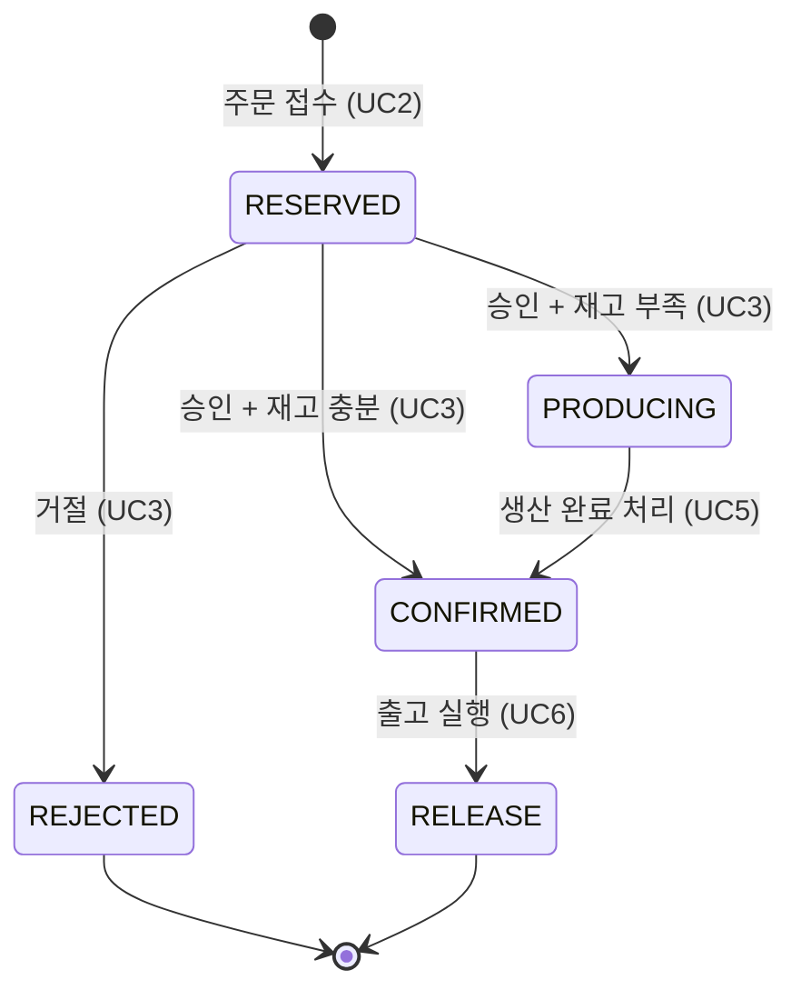

# 유스케이스 다이어그램

## 주문 상태 전이 흐름

## 주요 비즈니스 규칙 요약

| 유스케이스 | 사전조건 | 핵심 규칙 |
|-----------|---------|---------|
| 주문 접수 | 시료가 등록되어 있어야 함 | 미등록 시료 → 오류 |
| 주문 승인 | 상태가 RESERVED여야 함 | 재고 ≥ 주문량 → CONFIRMED, 재고 < 주문량 → PRODUCING |
| 주문 거절 | 상태가 RESERVED여야 함 | CONFIRMED/PRODUCING 거절 불가 |
| 생산 완료 | 생산 큐가 비어있지 않아야 함 | FIFO 순서, 실생산량 = ⌈부족분 / (수율 × 0.9)⌉ |
| 출고 실행 | 상태가 CONFIRMED여야 함 | 다른 상태 → 오류 |
| 모니터링 | - | REJECTED 주문은 집계에서 제외 |
